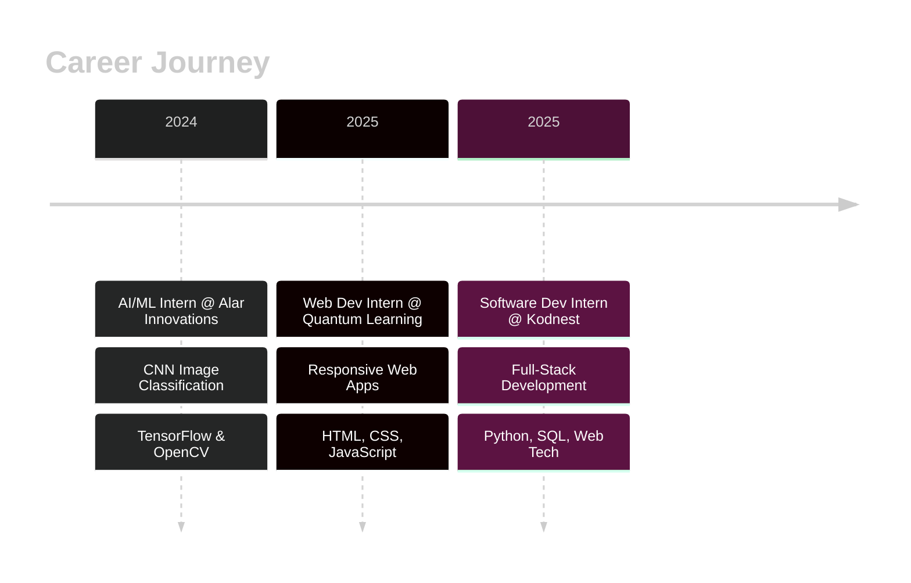

<div align="center">
  
</div>

<div align="center">
  
  [](https://git.io/typing-svg)
  
</div>

<div align="center">
  
  [](https://github.com/smitha113)
  [](https://github.com/smitha113?tab=followers)
  [](https://github.com/smitha113?tab=repositories)
  
</div>

---

## 🧬 ABOUT_ME.exe

```python
class QuantumResearcher:
    def __init__(self):
        self.name = "Smitha Prabhu"
        self.role = "ML Researcher & HPC Developer"
        self.location = "Manipal, India 🇮🇳"
        self.education = {
            "current": "MTech CS @ Manipal Institute of Technology (GPA: 9.09)",
            "past": "BE CS @ SMVITM, Bantakal (CGPA: 9.33)"
        }
        self.research_focus = [
            "Quantum-Classical ML for Medical Imaging",
            "CUDA Parallelization of Optimization Algorithms",
            "High-Performance Computing"
        ]
        
    def current_projects(self):
        return {
            "CalmDown": "AI Mental Health Platform (Flask + LLM)",
            "Phobia Insight": "LLM-based Self-Help System",
            "Health Monitor": "Remote Patient Monitoring with Smart Alerts"
        }
    
    def say_hi(self):
        print("Thanks for dropping by! Let's build something revolutionary 🚀")

me = QuantumResearcher()
me.say_hi()
```

---

## 🔬 RESEARCH HIGHLIGHTS

<table>
<tr>
<td width="50%">

### ⚛️ Quantum Machine Learning
```yaml
Focus: Hybrid quantum-classical models
Domain: Medical image classification
Stack: Qiskit, TensorFlow, PyTorch
Status: 🔬 Active Research
```

</td>
<td width="50%">

### ⚡ High-Performance Computing
```yaml
Project: Multi-objective optimization
Tech: CUDA parallelization
Impact: Massive computational speedup
Status: ✅ Completed
```

</td>
</tr>
</table>

---

## 💻 TECH ARSENAL

<div align="center">

### Languages & Frameworks


### AI/ML & Deep Learning


### Web & Backend


### HPC & Cloud


### Tools & IDEs


</div>

---

## 🚀 FEATURED PROJECTS

<div align="center">

<table>
<tr>
<td width="50%">

<h3 align="center">🧠 CalmDown</h3>
<div align="center">  
<a href="https://github.com/smitha113" target="_blank"></a>
</div>
<br>
<p><strong>AI Mental Health Platform</strong></p>
<p>🔹 Flask + LLM-based chatbot</p>
<p>🔹 Structured assessments & mood tracking</p>
<p>🔹 Responsible AI recommendations</p>
<p>🔹 Non-diagnostic, privacy-focused</p>

</td>
<td width="50%">

<h3 align="center">👁️ Phobia Insight System</h3>
<div align="center">  
<a href="https://github.com/smitha113" target="_blank"></a>
<a href="#" target="_blank"></a>
</div>
<br>
<p><strong>LLM-Powered Self-Help</strong></p>
<p>🔹 Analyzes fear experiences using LLMs</p>
<p>🔹 Explainable insights</p>
<p>🔹 Deployed on Render</p>
<p>🔹 Privacy-first architecture</p>

</td>
</tr>
<tr>
<td width="50%">

<h3 align="center">💓 Remote Health Monitor</h3>
<div align="center">  
<a href="https://github.com/smitha113" target="_blank"></a>
</div>
<br>
<p><strong>Smart Healthcare System</strong></p>
<p>🔹 Real-time vitals monitoring</p>
<p>🔹 Rule-based alert system</p>
<p>🔹 Explainable AI for caregivers</p>
<p>🔹 Data privacy compliant</p>

</td>
<td width="50%">

<h3 align="center">⚡ CUDA Optimizer</h3>
<div align="center">  
<a href="https://github.com/smitha113" target="_blank"></a>
</div>
<br>
<p><strong>HPC Research Project</strong></p>
<p>🔹 Parallelized multi-objective algorithm</p>
<p>🔹 CUDA acceleration</p>
<p>🔹 Massive performance gains</p>
<p>🔹 Academic publication pending</p>

</td>
</tr>
</table>

</div>

---

## 📊 GITHUB ANALYTICS

<div align="center">
  


</div>

<div align="center">
  


</div>

---

## 🏆 ACHIEVEMENTS & CERTIFICATIONS

<div align="center">


</div>

<table>
<tr>
<td width="50%">

### 🎓 Academic Excellence
- 🥇 **MTech CGPA: 9.09** - Manipal Institute of Technology
- 🥇 **BTech CGPA: 9.33** - SMVITM, Bantakal
- 🥇 **PUC: 99.66%** - Mahatma Gandhi Memorial College

</td>
<td width="50%">

### 📜 Certifications
- ☁️ **AWS Cloud Practitioner Essentials**
- 🤖 **Generative AI** - Microsoft & LinkedIn
- 💻 **Software Development** - Microsoft & LinkedIn
- 🎨 **Front-End Development** - Infosys Springboard

</td>
</tr>
</table>

---

## 💼 PROFESSIONAL EXPERIENCE



---

## 🎯 LEADERSHIP & IMPACT

<div align="center">

| Role | Impact |
|------|--------|
| 🏛️ **Secretary, CodeTroopers Club** | Led technical initiatives at SMVITM |
| 👨‍🏫 **Workshop Conductor** | Trained 150+ students in Web & Android Dev |
| 🌟 **IEEE Eureka Trainer** | AI fundamentals for 100+ government school students |

</div>

---

## 📫 CONNECT WITH ME

<div align="center">

[](https://smithaprabhu.netlify.app)
[](https://linkedin.com/in/smitha-prabhu)
[](https://github.com/smitha113)
[](mailto:smitha.in.tech@gmail.com)
[](tel:+916360067288)

</div>

---

## 🐍 CONTRIBUTION GRAPH

<div align="center">
  


</div>

---

## 💭 RANDOM DEV QUOTE

<div align="center">


</div>

---

<div align="center">

### 🌟 "Bridging Quantum Computing, AI, and Real-World Impact" 🌟


</div>

<!-- Proudly crafted with 💙 by Smitha -->
